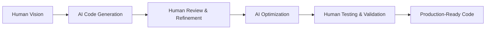

# Attribution and Credits

## Original Inspiration

This .NET AI Search Solution is inspired by and based on the excellent work from the Microsoft Azure Samples team:

### ?? [Azure AI Search Multimodal Sample](https://github.com/Azure-Samples/azure-ai-search-multimodal-sample)

**Repository:** https://github.com/Azure-Samples/azure-ai-search-multimodal-sample  
**Language:** Python  
**Framework:** FastAPI + Streamlit  
**License:** MIT License  

### What We Adapted

The original Python sample provided the foundational concepts and architecture that we've implemented in .NET:

#### **Core Concepts Adapted:**
- Multimodal document processing workflow
- Azure AI Search integration patterns
- Vector search and hybrid search implementation
- Document Intelligence integration
- OpenAI embeddings and chat completion patterns
- Index management and configuration

#### **API Design Patterns:**
- Document upload and processing endpoints
- Search API structure and parameters
- Chat interface with document grounding
- Index management operations

#### **UI/UX Concepts:**
- Search interface design principles
- Chat interface layout and interaction patterns
- Document management workflows
- Configuration and settings organization

## AI-Assisted Development

This project was developed with significant assistance from AI tools, demonstrating the power of human-AI collaboration in software development:

### ?? **AI Development Partners**

#### **Claude Sonnet 3.5 (Anthropic)**
- **Architecture Design:** Helped design the clean architecture patterns and project structure
- **Code Generation:** Assisted in generating complex service implementations and API controllers
- **Best Practices:** Provided guidance on .NET 9 features and modern C# patterns
- **Documentation:** Contributed to comprehensive documentation and code comments
- **Security Implementation:** Helped implement Azure AD authentication and security features

#### **GPT-4 (OpenAI)**
- **Code Refinement:** Assisted in optimizing and refining generated code
- **Problem Solving:** Helped troubleshoot integration challenges with Azure services
- **Testing Strategies:** Provided guidance on testing approaches and error handling
- **Performance Optimization:** Suggested performance improvements and async patterns
- **API Design:** Contributed to RESTful API design and Swagger documentation

### ?? **AI-Human Collaboration Benefits**

#### **Development Acceleration:**
- **Rapid Prototyping:** AI assistance enabled quick iteration on complex features
- **Code Quality:** AI suggestions helped maintain consistent coding standards
- **Documentation:** Comprehensive documentation generated with AI assistance
- **Best Practices:** AI knowledge helped implement industry best practices

#### **Learning and Knowledge Transfer:**
- **Cross-Platform Adaptation:** AI helped translate Python concepts to .NET patterns
- **Modern Frameworks:** AI provided guidance on .NET 9 and ASP.NET Core 9 features
- **Azure Integration:** AI assisted with complex Azure service integrations
- **Security Patterns:** AI helped implement enterprise-grade security features

### ?? **Development Methodology**

This project demonstrates effective **AI-Assisted Development** practices:

#### **Human Responsibilities:**
- ? **Vision & Requirements:** Defining project goals and business requirements
- ? **Architecture Decisions:** Making high-level technical and business decisions
- ? **Code Review:** Reviewing and refining AI-generated code
- ? **Testing & Validation:** Ensuring functionality and quality standards
- ? **Domain Expertise:** Providing business context and user requirements

#### **AI Contributions:**
- ?? **Code Generation:** Rapid generation of boilerplate and complex implementations
- ?? **Pattern Recognition:** Suggesting established patterns and best practices
- ?? **Documentation:** Generating comprehensive documentation and comments
- ?? **Optimization:** Suggesting performance and security improvements
- ?? **Debugging:** Helping identify and resolve technical issues

## Our .NET Implementation

While maintaining the core functionality and concepts from the original Python sample, we've adapted and enhanced the solution for the .NET ecosystem:

### **Technology Migration:**
- **Backend:** FastAPI ? ASP.NET Core 9 Web API
- **Frontend:** Streamlit ? Razor Pages with Bootstrap
- **Language:** Python ? C# with .NET 9
- **Authentication:** None ? Azure AD integration
- **Deployment:** Docker ? Azure App Service ready

### **Enterprise Enhancements:**
- **Security:** Added comprehensive Azure AD authentication and authorization
- **Performance:** Optimized for .NET runtime characteristics
- **Type Safety:** Strong typing throughout the application
- **Production Readiness:** Enterprise-grade error handling, logging, and configuration
- **UI/UX:** Modern responsive web interface with Material Design principles

### **Additional Features:**
- Token management and refresh mechanisms
- CORS configuration for cross-origin requests
- CSRF protection and input validation
- Comprehensive API documentation with Swagger
- Multiple authentication modes (Simple, Enhanced, Standard)
- Real-time AJAX interactions

## Community and Collaboration

This project demonstrates the power of open-source collaboration, cross-platform learning, and AI-assisted development:

### **Benefits of the Original Python Sample:**
- ?? **Quick Prototyping:** Streamlit frontend for rapid development
- ?? **Excellent Documentation:** Comprehensive setup and usage guides
- ?? **Python Ecosystem:** Leverage Python's AI/ML libraries
- ?? **Research Focus:** Perfect for experimentation and research scenarios

### **Benefits of Our .NET Implementation:**
- ?? **Enterprise Ready:** Production-grade authentication and security
- ? **Performance:** Optimized for high-throughput scenarios
- ?? **Security:** Built-in security features and enterprise authentication
- ??? **Tooling:** Rich development experience with Visual Studio and .NET tooling
- ?? **Modern UI:** Responsive web interface suitable for all devices

### **Benefits of AI-Assisted Development:**
- ?? **Development Speed:** Faster iteration and implementation cycles
- ?? **Code Quality:** Consistent patterns and best practices
- ?? **Knowledge Transfer:** Cross-platform learning and adaptation
- ?? **Problem Solving:** Rapid troubleshooting and optimization

## Credits and Recognition

### **Microsoft Azure Samples Team**
Special thanks to the Azure Samples team for creating and maintaining the original Python implementation. Their work provided:
- Solid architectural foundation
- Best practices for Azure AI Services integration
- Clear documentation and examples
- Open-source collaboration model

### **AI Development Partners**
- **Anthropic Claude Sonnet 3.5:** For architectural guidance, code generation, and comprehensive documentation
- **OpenAI GPT-4:** For code refinement, problem-solving, and optimization suggestions
- **Human Developer:** For vision, requirements, testing, and quality assurance

### **Technologies and Frameworks**
- **Microsoft Azure AI Services:** Azure AI Search, Azure OpenAI, Azure Document Intelligence
- **Microsoft .NET Team:** .NET 9 framework and ASP.NET Core
- **Bootstrap Team:** CSS framework for responsive design
- **jQuery Foundation:** JavaScript library for DOM manipulation
- **Material Design:** Google's design system and icons

## License Compatibility

Both the original Python sample and this .NET implementation are released under the **MIT License**, ensuring:
- ? Open source collaboration
- ? Commercial usage allowed
- ? Modification and distribution permitted
- ? Attribution requirements met

## Contributing Back

We believe in giving back to the community. If you find improvements or create enhancements:

### **Contribute to Original Python Sample:**
- Report issues or suggest improvements to the original repository
- Share your use cases and success stories
- Contribute documentation improvements

### **Contribute to This .NET Implementation:**
- Fork our repository and submit pull requests
- Report bugs and suggest new features
- Improve documentation and examples
- Share your deployment experiences

### **AI-Assisted Development Best Practices:**
- Share your AI collaboration experiences
- Contribute patterns for effective human-AI development
- Document AI tool usage and effectiveness
- Help establish best practices for AI-assisted software development

## Related Resources

### **Original Python Sample:**
- **Repository:** https://github.com/Azure-Samples/azure-ai-search-multimodal-sample
- **Documentation:** Comprehensive setup and usage guides
- **Issues:** Report Python-specific issues and discussions

### **Our .NET Implementation:**
- **Repository:** https://github.com/nhcloud/aisearch
- **Documentation:** .NET-specific setup and enterprise deployment guides
- **Issues:** Report .NET-specific issues and feature requests

### **AI Development Tools:**
- **Anthropic Claude:** https://www.anthropic.com/claude
- **OpenAI GPT-4:** https://openai.com/gpt-4
- **GitHub Copilot:** https://github.com/features/copilot
- **AI-Assisted Development Resources:** Various guides and best practices

### **Microsoft Documentation:**
- **Azure AI Search:** https://docs.microsoft.com/en-us/azure/search/
- **Azure OpenAI:** https://docs.microsoft.com/en-us/azure/openai/
- **ASP.NET Core:** https://docs.microsoft.com/en-us/aspnet/core/
- **.NET 9:** https://docs.microsoft.com/en-us/dotnet/core/whats-new/dotnet-9

---

**Thank you to the Azure Samples team, the AI development community, and the broader open-source community for making projects like this possible! ??**

*This project demonstrates the future of software development through effective human-AI collaboration.*