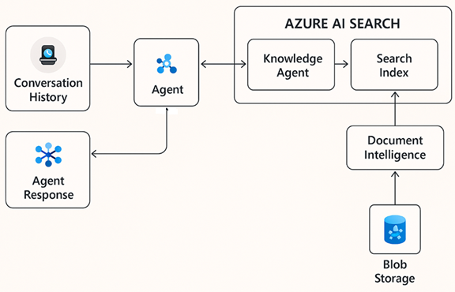

# AI Search Solution

A comprehensive AI-powered search solution based on Azure AI Search multimodal capabilities, featuring a .NET 9 backend API and a .NET 9 Razor Pages frontend with Azure AD authentication.

> **📝 Attribution:** This .NET implementation is inspired by and based on the [Azure AI Search Multimodal Sample](https://github.com/Azure-Samples/azure-ai-search-multimodal-sample) Python repository. We've adapted the concepts and functionality to the .NET ecosystem while adding enterprise-grade features like Azure AD authentication and a modern Razor Pages frontend.

> **🤖 AI-Assisted Development:** This project was developed with significant assistance from AI tools, demonstrating effective human-AI collaboration. Primary AI partners: **Claude Sonnet 4** (Anthropic) for architecture and code generation, and **GPT-5 Preview** (OpenAI) for refinement and optimization. The result showcases how AI can accelerate development while maintaining high code quality and comprehensive documentation.

## 🏗️ Project Structure

```
AISearch/
├── dotnet/
│   ├── AISearch.Web/              # .NET 9 Razor Pages/MVC frontend
│   ├── AISearch.Api/              # .NET 9 Web API backend
│   └── AISearch.Core/             # Core business logic and models
├── docs/                          # Documentation
└── scripts/                       # Build and deployment scripts
```

## 📐 System Architecture


*System architecture showing the relationship between frontend, backend, Azure services, and data flow*

### **Architecture Overview:**
- **Frontend Layer**: .NET 9 Razor Pages with Azure AD authentication
- **API Layer**: .NET 9 Web API with comprehensive REST endpoints
- **Business Logic**: Clean architecture with dependency injection
- **Azure Services**: AI Search, OpenAI, Document Intelligence, Storage
- **Authentication**: Azure AD with token management and refresh
- **Data Flow**: Document processing → Embedding generation → Vector search → AI chat

## ✨ Features

### Frontend (.NET 9 Razor Pages/MVC)
- **Document Management**: Upload, index, and manage multimodal documents
- **AI Search Interface**: Semantic search with configurable parameters
- **Chat Interface**: Interactive chat with document grounding
- **Index Management**: Visual index creation and configuration
- **Azure AD Authentication**: Secure login with Microsoft Identity
- **Material Design UI**: Bootstrap-based responsive interface
- **Real-time Updates**: AJAX-powered interactions with jQuery

### Backend (.NET 9 Web API)
- **Document Management**: Upload, index, and manage multimodal documents
- **AI Search**: Semantic search with Azure AI Search
- **Vector Search**: Embedding-based similarity search
- **Multimodal RAG**: Chat interface with document grounding
- **Index Management**: Create and manage search indexes
- **Swagger Documentation**: Interactive API testing
- **Azure Integration**: AI Search, OpenAI, Document Intelligence, and Storage services

## 🚀 Getting Started

### Prerequisites
- .NET 9 SDK
- Visual Studio 2022 or VS Code
- Azure subscription with:
  - Azure AI Search service
  - Azure OpenAI service
  - Azure Storage account
  - Azure Document Intelligence service
  - Azure AD app registration

### Frontend Setup (AISearch.Web)

1. **Navigate to frontend directory**:
   ```bash
   cd dotnet/AISearch.Web
   ```

2. **Configure application settings**:
   Update `appsettings.json` with your Azure service credentials:
   ```json
   {
     "Logging": {
       "LogLevel": {
         "Default": "Information",
         "Microsoft.AspNetCore": "Warning",
         "Microsoft.AspNetCore.Authentication": "Information",
         "Microsoft.Identity.Web": "Information"
       }
     },
     "AllowedHosts": "*",
     "UseSimpleAuth": true,
     "ApiSettings": {
       "BaseUrl": "https://localhost:7001"
     },
     "AzureAd": {
       "Instance": "https://login.microsoftonline.com/",
       "Domain": "your-domain.onmicrosoft.com",
       "ClientId": "your-client-id",
       "TenantId": "your-tenant-id",
       "CallbackPath": "/signin-oidc",
       "SignedOutCallbackPath": "/signout-callback-oidc",
       "ClientSecret": "your-client-secret"
     },
     "DownstreamApi": {
       "BaseUrl": "https://localhost:7001",
       "Scopes": "User.Read"
     }
   }
   ```

3. **Restore dependencies**:
   ```bash
   dotnet restore
   ```

4. **Build and run**:
   ```bash
   dotnet build
   dotnet run
   ```

5. **Access application**: Open `https://localhost:7002`

### Backend Setup (AISearch.Api)

1. **Navigate to backend directory**:
   ```bash
   cd dotnet/AISearch.Api
   ```

2. **Configure application settings**:
   Update `appsettings.json` with your Azure service credentials:
   ```json
   {
     "AzureSearch": {
       "ServiceEndpoint": "https://your-search-service.search.windows.net",
       "IndexName": "knowledge-index",
       "SearchAdminKey": "your-search-admin-key",
       "OpenAIEndpoint": "https://your-openai-service.openai.azure.com",
       "OpenAIModelName": "gpt-4",
       "OpenAIDeploymentName": "gpt-4",
       "OpenAIEmbeddingModel": "text-embedding-3-large",
       "OpenAIEmbeddingDeploymentName": "text-embedding-3-large",
       "VectorDimensions": 3072,
       "OpenAIApiKey": "your-openai-api-key",
       "StorageAccountUrl": "https://your-storage.blob.core.windows.net",
       "StorageAccountKey": "your-storage-key",
       "ArtifactsContainer": "artifacts",
       "SamplesContainer": "samples",
       "KnowledgeAgentName": "knowledge-agent",
       "DocumentIntelligenceEndpoint": "https://your-doc-intelligence.cognitiveservices.azure.com/",
       "DocumentIntelligenceApiKey": "your-doc-intelligence-key"
     },
     "AzureAd": {
       "Instance": "https://login.microsoftonline.com/",
       "Domain": "your-domain.onmicrosoft.com",
       "ClientId": "your-client-id",
       "TenantId": "your-tenant-id",
       "Audience": "your-client-id"
     }
   }
   ```

3. **Build and run**:
   ```bash
   dotnet build
   dotnet run
   ```

4. **Access Swagger UI**: Open `https://localhost:7001/swagger`

## 📊 Data Flow Architecture


*Document processing pipeline from upload to search and chat interactions*

### **Processing Pipeline:**
1. **Document Upload** → Azure Storage + Document Intelligence
2. **Content Extraction** → Text, tables, images processing
3. **Intelligent Chunking** → Optimal content segmentation
4. **Embedding Generation** → OpenAI text-embedding-3-large
5. **Vector Indexing** → Azure AI Search with hybrid capabilities
6. **Search & Chat** → Semantic search + GPT-4 chat completions

## 📚 API Endpoints

### Documents
- `POST /api/documents/upload` - Upload and index documents
- `GET /api/documents` - List all documents
- `GET /api/documents/{id}` - Get document details
- `DELETE /api/documents/{id}` - Delete document
- `POST /api/documents/{id}/reindex` - Re-index document

### Search
- `POST /api/search` - Perform text/semantic search
- `POST /api/search/vector` - Vector similarity search
- `POST /api/search/similar/{documentId}` - Find similar documents

### Chat
- `POST /api/chat` - Chat with document grounding
- `POST /api/chat/stream` - Streaming chat responses

### Index Management
- `POST /api/indexes` - Create new search index
- `GET /api/indexes` - List all indexes
- `GET /api/indexes/{name}` - Get index details
- `DELETE /api/indexes/{name}` - Delete index

## 🛠️ Technologies Used

### Frontend (AISearch.Web)
- **.NET 9**: Latest .NET framework
- **ASP.NET Core Razor Pages/MVC**: Web framework
- **Azure AD Authentication**: Microsoft Identity integration
- **Bootstrap 5**: Responsive CSS framework
- **jQuery**: JavaScript library for DOM manipulation
- **Material Icons**: Google Material Design icons
- **AJAX**: For seamless API integration

### Backend (AISearch.Api)
- **.NET 9**: Latest .NET framework
- **Azure AI Search SDK**: For search and indexing capabilities
- **Azure.AI.OpenAI**: For embeddings and chat completions
- **Azure Storage Blobs**: For document storage
- **Azure Document Intelligence**: For document processing
- **Swagger/OpenAPI**: API documentation

### Core (AISearch.Core)
- **Azure.Search.Documents**: Search operations
- **Azure.AI.DocumentIntelligence**: Document processing
- **Azure.Identity**: Authentication
- **Microsoft.Extensions**: Dependency injection and configuration

## 🔧 Configuration

### Development Environment
Create `appsettings.Development.json` for local development:

```json
{
  "Logging": {
    "LogLevel": {
      "Default": "Information",
      "Microsoft.AspNetCore": "Warning"
    }
  },
  "UseSimpleAuth": true,
  "ApiSettings": {
    "BaseUrl": "https://localhost:7001"
  },
  "AzureAd": {
    "Instance": "https://login.microsoftonline.com/",
    "Domain": "your-dev-domain.onmicrosoft.com",
    "ClientId": "your-dev-client-id",
    "TenantId": "your-dev-tenant-id"
  }
}
```

### Authentication Configuration
The application supports multiple authentication modes:
- **Enhanced Auth**: Full Azure AD integration with token refresh
- **Simple Auth**: Basic Azure AD authentication
- **Standard Auth**: Default authentication mode

Configure in `appsettings.json`:
```json
{
  "UseSimpleAuth": true,
  "UseEnhancedAuth": false
}
```

## 🚀 Running the Application

### Development Mode
1. **Start the API backend**:
   ```bash
   cd dotnet/AISearch.Api
   dotnet run
   ```
   API will be available at: `https://localhost:7001`

2. **Start the Razor Pages frontend**:
   ```bash
   cd dotnet/AISearch.Web
   dotnet run
   ```
   Web app will be available at: `https://localhost:7002`

3. **Access the application**:
   - Frontend: `https://localhost:7002`
   - API: `https://localhost:7001`
   - Swagger UI: `https://localhost:7001/swagger`

### Production Deployment

1. **Build for production**:
   ```bash
   dotnet publish -c Release -o ./publish
   ```

2. **Configure production settings** in `appsettings.Production.json`

3. **Deploy to Azure App Service** or your preferred hosting platform

## 📖 Usage Examples

### Access the Web Interface
1. Navigate to `https://localhost:7002`
2. Sign in with your Azure AD credentials
3. Use the navigation menu to access different features

### Upload Documents via API
```bash
curl -X POST "https://localhost:7001/api/documents/upload" \
  -H "Content-Type: multipart/form-data" \
  -F "file=@document.pdf" \
  -F "title=My Document" \
  -F "description=Document description"
```

### Search Documents via API
```bash
curl -X POST "https://localhost:7001/api/search" \
  -H "Content-Type: application/json" \
  -d '{
    "query": "artificial intelligence",
    "top": 10,
    "threshold": 0.7
  }'
```

### Chat with Documents via API
```bash
curl -X POST "https://localhost:7001/api/chat" \
  -H "Content-Type: application/json" \
  -d '{
    "messages": [
      {
        "role": "user",
        "content": [{"type": "text", "text": "What is machine learning?"}]
      }
    ],
    "useGrounding": true
  }'
```

## 🖥️ User Interface Features

### Main Pages
- **Home**: Dashboard with authentication status
- **Search**: Advanced search interface with filters and configuration
- **Chat**: Interactive chat with document grounding
- **Document Management**: Upload and manage documents
- **Index Management**: Create and configure search indexes

### UI Components
- **Material Design**: Consistent with modern web standards
- **Responsive Layout**: Works on desktop and mobile devices
- **Real-time Feedback**: Loading states and progress indicators
- **Error Handling**: User-friendly error messages
- **Authentication Flow**: Seamless Azure AD integration

## 🔒 Security Features

- **Azure AD Authentication**: Secure user authentication
- **CSRF Protection**: Built-in request forgery protection
- **XSS Prevention**: Input sanitization and encoding
- **Token Management**: Automatic token refresh
- **Secure Headers**: Security headers configuration
- **Input Validation**: Server-side validation
- **CORS Configuration**: Proper cross-origin resource sharing

## 🏗️ Build Status

- ✅ Frontend (.NET 9 Razor Pages) - **Build Successful**
- ✅ Backend (.NET 9 API) - **Build Successful**
- ✅ Core Library (.NET 9) - **Build Successful**
- ⚠️ Configuration Required - Azure service credentials needed

## 🔗 Related Projects

### Original Python Implementation
This .NET implementation is based on the excellent work from the Azure Samples team:

**[Azure AI Search Multimodal Sample](https://github.com/Azure-Samples/azure-ai-search-multimodal-sample)**
- Original Python/FastAPI implementation
- Comprehensive multimodal search capabilities
- Streamlit frontend for quick prototyping
- Excellent documentation and examples

### Key Differences in .NET Version
- **Enterprise Authentication**: Full Azure AD integration with token management
- **Razor Pages Frontend**: Server-side rendered UI with modern responsive design
- **Type Safety**: Strong typing with C# throughout the application
- **Performance**: Optimized for .NET runtime performance characteristics
- **Security**: Enhanced security features built into ASP.NET Core
- **Deployment**: Ready for enterprise deployment scenarios
- **AI-Assisted Development**: Built using modern AI development tools and practices

### Development Methodology
This project demonstrates **AI-Assisted Development** best practices:
- **Human Vision + AI Implementation**: Strategic decisions by humans, rapid implementation with AI
- **Iterative Refinement**: Continuous improvement through human-AI collaboration
- **Quality Assurance**: Human oversight ensuring production-ready code
- **Documentation**: Comprehensive documentation generated with AI assistance

## 🤝 Contributing

1. Fork the repository
2. Create a feature branch
3. Follow the existing code style and patterns
4. Ensure all features maintain UI consistency
5. Add appropriate error handling and loading states
6. Test across different browsers and device sizes
7. Submit a pull request

## 📝 License

This project is licensed under the MIT License.

## 🆘 Support

For issues and questions:
1. Check the Swagger documentation at `https://localhost:7001/swagger`
2. Review the configuration section above
3. Ensure all Azure services are properly configured
4. Check the application logs for detailed error information
5. Verify Azure AD app registration settings

## 📋 Prerequisites Checklist

- [ ] .NET 9 SDK installed
- [ ] Azure subscription active
- [ ] Azure AI Search service created
- [ ] Azure OpenAI service deployed
- [ ] Azure Document Intelligence service configured
- [ ] Azure Storage account configured
- [ ] Azure AD app registration completed
- [ ] Application settings configured
- [ ] Dependencies restored

## 🔄 .NET 9 Migration Notes

### What's New in .NET 9
- **Performance Improvements**: Enhanced runtime performance and memory management
- **C# 13 Features**: New language features and syntax improvements
- **ASP.NET Core Enhancements**: Better performance and new features
- **Enhanced Security**: Improved security features and vulnerability mitigation

### Migration Steps Completed
1. ✅ Updated all project files to target `net9.0`
2. ✅ Upgraded Microsoft packages to version 9.0.0
3. ✅ Maintained Azure SDK versions (they are .NET 9 compatible)
4. ✅ Updated documentation to reflect .NET 9

### Post-Migration Steps
1. **Install .NET 9 SDK**: Download from [Microsoft .NET Downloads](https://dotnet.microsoft.com/download/dotnet/9.0)
2. **Restore packages**: Run `dotnet restore` in each project directory
3. **Build and test**: Verify all projects build successfully
4. **Update CI/CD**: Update build pipelines to use .NET 9

---

**Note**: Make sure to configure your Azure services and update both `appsettings.json` files (Web and API projects) before running the application. The frontend requires the backend API to be running for full functionality.

**AI Development Note**: This project showcases the potential of AI-assisted development, combining human expertise with AI capabilities to create production-ready software efficiently and effectively.
